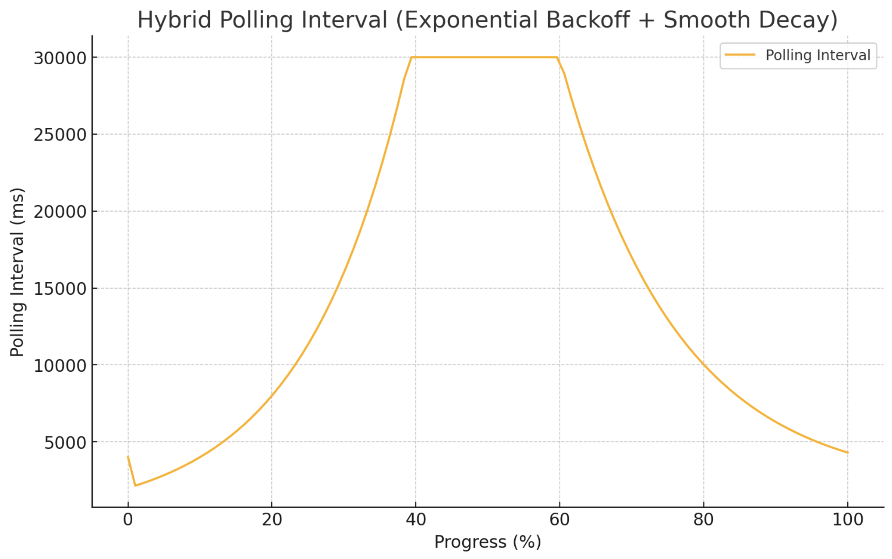

# Translation Client Library - README

## Overview

The Translation Client Library is designed to interact with a simulated video translation backend. It provides an efficient way to repeatedly query the translation job status using an **Adaptive Polling Strategy** that dynamically adjusts polling intervals based on progress and expected completion time. This mechanism optimizes resource usage while ensuring timely updates, reducing unnecessary network requests during early stages and increasing polling frequency as the task nears completion. This documentation will guide you through the steps to use the client library effectively.

## Getting Started

### Installation

Clone the repository containing the server and client code, and navigate to the project directory:

```bash
git clone https://github.com/vaibhavbhajanka/video-translation.git
cd video-translation
```

### Prerequisites

To use the client library, ensure you have the following installed:

- Node.js (v12 or above)
- npm (Node Package Manager)


The library depends on `axios` for making HTTP requests. Install it using the following command:

```bash
npm install axios
```

### Integration Test

To demonstrate the client library's functionality, an integration test has been provided. The test spins up the server and uses the client library to fetch the final job status.

- **Automation of Server Startup**: The integration test (`test/integration.test.js`) automatically starts the server as a child process before testing and uses Jest's `beforeAll` and `afterAll` hooks to manage server lifecycle.
    - **Benefit**: This automation simplifies the testing process, ensuring the server is running and ready before tests execute, which demonstrates best practices and enhances developer experience.

To run the integration test (Ensure you are in the root directory before running the integration test):

```bash
npm test
```

This will start the server, run the client library, and log the results.

### Sample Output

You may see logs like the following during execution:

```
Attempt 1: Status - pending, Progress - 10%, Expected Time - 120000ms
Waiting for 5 seconds before retrying...
...
Final Status: completed
```

### Using the Client Library

The client library consists of three main components:

1. **StatusFetcher**: Fetches the status of the translation job from the server. The JSON response includes `{ status, progress, expectedTime }`.
<br><br>
    - **Error Handling and Default Fallbacks**: The `StatusFetcher` class catches errors during HTTP requests and returns a default error status to ensure the client can continue operating even if a network error occurs temporarily, improving resilience.
<br><br>
2. **AdaptivePollingStrategy**: Determines the polling interval based on job progress to optimize resource usage.
   <br><br>
    - **Dynamic Adjustment Based on Expected Completion Time**: Polling intervals are dynamically calculated using the `expectedTime` returned by the server, adjusting according to job length to provide flexibility.
    - **Configurable Parameters**: Allows customization of polling intervals, decay factors, and transition progress thresholds through constructor parameters, providing flexibility and enabling users to tailor behavior.
      <br><br>
      
   <br><br>
3. **StatusChecker**: Uses the fetcher and polling strategy to query the status until the job is completed or fails.
   <br><br>
    - **Comprehensive Logging**: Logs detailed information at each polling attempt, including status, progress, expected time, and waiting intervals, enhancing observability and aiding users in monitoring and troubleshooting.


### Running the Server (Ensure server is up and running if video translation needs to be checked manually)

The translation server simulates a video translation backend with a configurable random delay. You need to start the server before running the client.

```bash
node server/server.js
```

This will start the server on `http://localhost:5001`. You should see a message like:

```
Server running on http://localhost:5001
```


Here's an example of how to use the client library to query the status of a translation job:

```javascript
const { StatusFetcher, AdaptivePollingStrategy, StatusChecker } = require("./client/src/translationClient");

(async () => {
    const fetcher = new StatusFetcher("http://localhost:5001/status");
    const strategy = new AdaptivePollingStrategy();
    const checker = new StatusChecker(fetcher, strategy);

    const finalStatus = await checker.checkStatus();
    console.log(`Final Status: ${finalStatus}`);
})();
```

### Implementation Details

- **StatusFetcher**:
<br><br>
    - Takes the URL of the translation server and makes repeated GET requests to fetch the current job status.
    - Returns a JSON response that includes the following keys:
        - `status`: The current status of the job (`pending`, `completed`, or `error`).
        - `progress`: An integer representing the progress percentage (0-100).
        - `expectedTime`: The estimated time for job completion in milliseconds.
    - **Error Handling**: If a network error occurs, it catches the error and returns a default status, ensuring that the client application remains stable.
      <br><br>
- **AdaptivePollingStrategy**:
<br><br>
    - Implements an adaptive polling mechanism to determine the optimal interval between polling requests.
    - Uses `transitionProgress` (default 60%) to decide when to switch from **exponential backoff** to **exponential(smooth) decay**:
        - **Exponential Backoff Phase**: In the early stages of a job, polling intervals increase exponentially to reduce server load.
        - **Progress-Based Exponential Decay Phase**: As progress nears completion, polling intervals decrease to ensure timely updates.
    - Uses `expectedTime` to dynamically calculate `dynamicMaxInterval` and `dynamicBaseInterval`:
        - `dynamicMaxInterval = expectedTime / 3.5`: Defines the maximum interval based on expected job duration.
        - `dynamicBaseInterval = expectedTime / 30`: Defines the minimum interval based on expected job duration.
    - The polling interval is determined by combining these dynamic values with exponential backoff or decay calculations to optimize responsiveness and resource usage:
      <br><br>
        - **Formulas Used**:
      
            - **Exponential Backoff Phase**: Uses `dynamicBaseInterval * (2 ** attempt)` to increase polling interval exponentially, ensuring fewer requests in the early stages when progress is low.
            - **Progress-Based Exponential Decay Phase**: Uses `dynamicBaseInterval + (dynamicMaxInterval - dynamicBaseInterval) * Math.exp(-progressFactor * 2.5)` to gradually decrease the interval as the job approaches completion, improving responsiveness.
              <br><br>
        - **Variables Explained**:
            - `dynamicMaxInterval`: Calculated as `expectedTime / 3.5` to define an optimal maximum polling interval based on the estimated job duration.
            - `dynamicBaseInterval`: Calculated as `expectedTime / 30` to define a suitable minimum interval for polling.
            - `progressFactor`: A normalized value representing the job's progress in the decay phase, calculated as `(progress - transitionProgress) / (100 - transitionProgress)`. This helps control how rapidly the polling interval decreases.
              <br><br>
        - **Iterations for Optimization**: Multiple iterations and calculations were done to find suitable values for `dynamicMaxInterval`, `dynamicBaseInterval`, `progressFactor` and `decayInterval`, ensuring an optimal balance between minimizing server load and maintaining timely status updates.
          <br><br>
- **StatusChecker**:
  <br><br>
    - Coordinates the polling by using the **StatusFetcher** and **AdaptivePollingStrategy** to fetch the job status until a final status (`completed` or `error`) is reached.
    - Logs the status, progress, and expected time at each polling attempt.
    - Uses the adaptive polling strategy to determine the optimal waiting time between polling attempts, ensuring the client remains responsive and efficient.

## Conclusion

The Translation Client Library provides an optimized, user-friendly way to interact with a video translation backend. By using adaptive polling, it strikes the right balance between minimizing server load and ensuring timely updates for the user. The code is built following **modular and SOLID design principles**, which ensures maintainability and reusability. Each component (`StatusFetcher`, `AdaptivePollingStrategy`, `StatusChecker`) has a **single responsibility**, making it easier to update or extend individual parts without affecting the rest of the library.

Additionally, features like **error handling** and **comprehensive logging** make the client robust. The inclusion of modern JavaScript features, detailed comments, and an automated integration test reflects a **customer-centric approach** that aims to provide a smooth experience for both developers and end-users.

